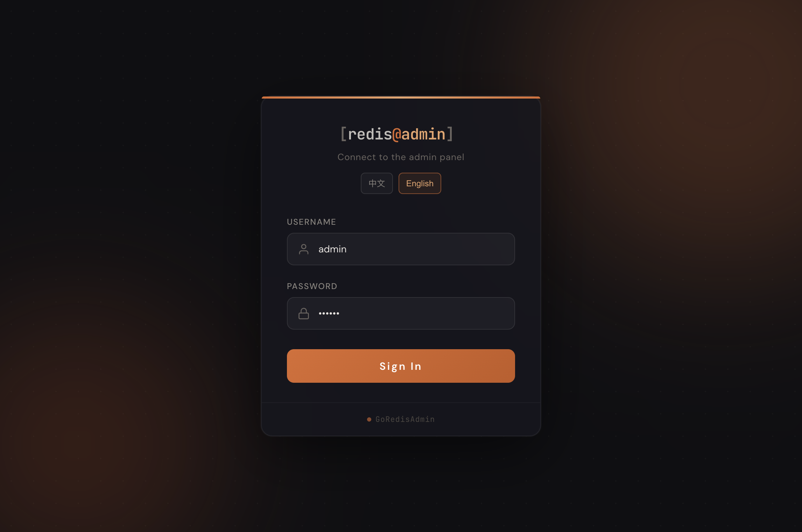
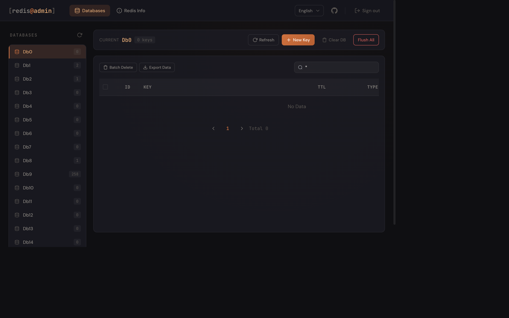
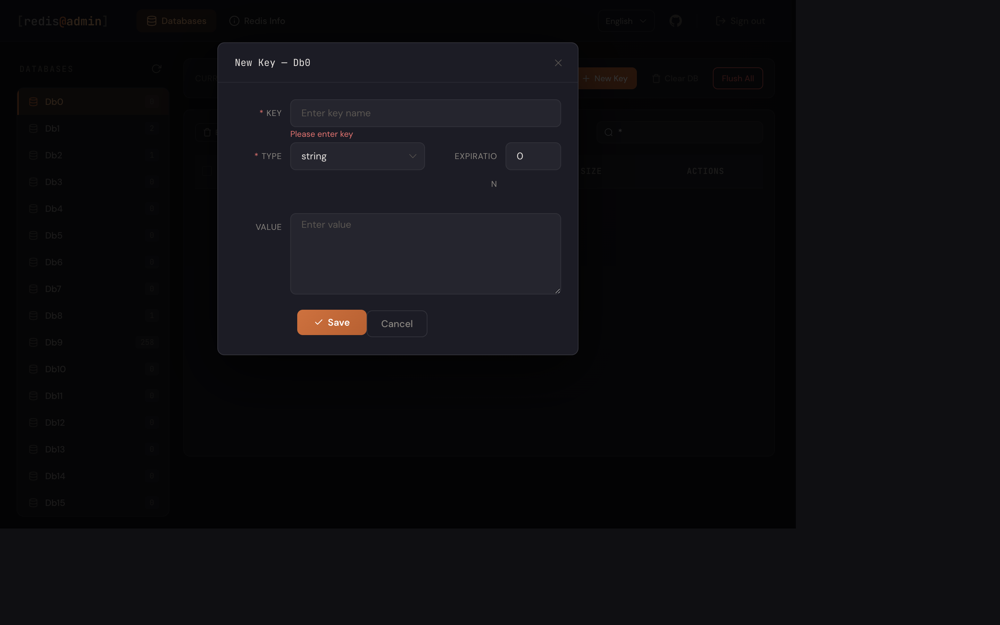
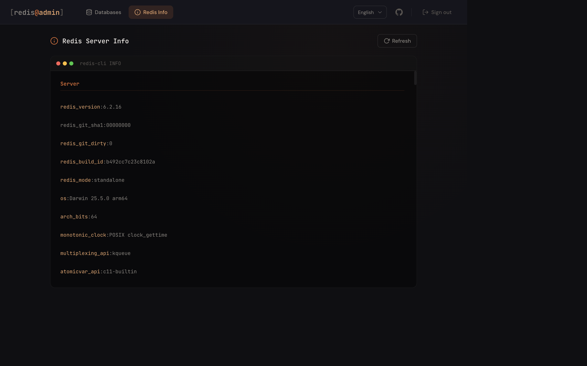

<p align="center">
    GoRedisAdmin
</p>

## Language

[English](README.md) | [中文](README.zh-CN.md)

## Introduction

GoRedisAdmin is a Redis admin platform built with Golang (Gin) and Vue 2 (Element UI). It provides online database management and a clean operation UI to make Redis data administration easier.

- [Documentation](https://github.com/linkaias/goRedisAdmin)
- Screenshots

### Login Page
Default credentials: `admin` / `123456`

<p align="center">
    
</p>

### Home Page
<p align="center">
    
</p>

### Add Key
<p align="center">
    
</p>

### Redis Info Page
<p align="center">
    
</p>

## Features

- Bilingual UI support (Chinese / English) with one-click language switch and preference persistence
- Login and logout with JWT authentication and auto token refresh
- Database list (Db0 - Db15)
- Redis key management with fuzzy search
- Create keys for five data types: string, list, set, zset, hash
- Configure key expiration
- Delete specific keys (supports batch delete)
- Clear current database (flushdb)
- Clear all databases (flushall)
- Export keys in batch as JSON files
- View Redis INFO details
- IP whitelist access control

## Tech Stack

| Layer | Technology |
| --- | --- |
| Backend | Go 1.25 + Gin + go-redis v6 |
| Frontend | Vue 2 + Element UI + Axios |
| Authentication | JWT (golang-jwt) |
| Logging | Logrus + daily file rotation |
| Configuration | INI format (ini.v1) |

## Installation

### Requirements

- Go 1.25+
- Node.js 14+ (only required if you need to modify frontend source code)
- Redis instance

### Deployment

```bash
# Clone project
git clone https://github.com/linkaias/goRedisAdmin.git

# Enter project directory
cd goRedisAdmin

# Create runtime directories
mkdir -p var/export

# Update configuration (Redis connection, admin account, port, etc.)
vim config.ini

# Install dependencies
go mod tidy

# Start server
go run main.go
```

After deployment, open http://127.0.0.1:9527 in your browser.

### Configuration

Edit `config.ini`:

```ini
[redis]
name = Localhost          # Connection name
host = 127.0.0.1          # Redis host
port = 6379               # Redis port
pwd =                     # Redis password (optional)
timeout = 60              # Connection timeout (seconds)
do_timeout = 60           # Operation timeout (seconds)

[whitelist_ip]
allow_ip = "127.0.0.1"    # IP whitelist, split by comma, no limit if empty

[admin]
username = "admin"        # Login username
password = "123456"       # Login password
port = 9527               # Service port

[log]
log_path = "var/log.log"  # Log path
max_save_day = 30         # Log retention days
```

### Manage with Shell Script

```bash
cd shell

# Build and start
sh run.sh gradmin build

# Start / Stop / Restart
sh run.sh gradmin start
sh run.sh gradmin stop
sh run.sh gradmin restart
```

### Frontend Development

```bash
cd web
npm install
npm run serve    # Start development server
npm run build    # Build to html/ directory
```

After login, use the language switch in the top navigation to toggle between Chinese and English.

## Project Structure

```text
goRedisAdmin/
├── main.go                    # Entry point
├── config.ini                 # Configuration
├── routers/                   # Routing layer
│   ├── view_router/           #   Frontend page routes
│   ├── api_router/            #   API routes (user/db/info)
│   └── middleware/            #   Middlewares (JWT, IP whitelist)
├── controller/                # Controller layer
│   ├── base_controller.go     #   Base controller
│   ├── user_controller/       #   Login/logout
│   ├── db_data_controller/    #   Redis data operations
│   └── info_controller/       #   Redis INFO
├── global/                    # Global state
│   ├── global_redis/          #   Redis client factory
│   ├── global_response/       #   Unified response structure
│   ├── global_write_ip/       #   IP whitelist
│   └── initData/              #   Config initialization
├── utils/                     # Utilities
│   ├── bcrypt_utils.go        #   JWT / bcrypt
│   ├── log_utils/             #   Logging (logrus + async writer)
│   └── exoprt_utils/          #   Key export
├── html/                      # Frontend build output (served by Go)
├── web/                       # Vue 2 frontend source code
└── var/                       # Runtime data (logs, export files)
```

## API

All endpoints are under `/api/v1`. Except login, requests require header `Authorization: Bearer <token>`.

| Method | Path | Description |
| --- | --- | --- |
| POST | /api/v1/user/login | Login |
| GET | /api/v1/user/logout | Logout |
| GET | /api/v1/db/db_list | Get database list |
| GET | /api/v1/db/get_keys | Get key list for a database |
| GET | /api/v1/db/get_val | Get key detail |
| POST | /api/v1/db/get_val_by_key | Get key value by type |
| POST | /api/v1/db/key | Create key |
| DELETE | /api/v1/db/key | Delete key |
| POST | /api/v1/db/key/expire | Update key expiration |
| DELETE | /api/v1/db/flush | Clear current database |
| POST | /api/v1/db/export_keys | Export keys in batch |
| GET | /api/v1/info/get_info | Get Redis INFO |

## JetBrains Open Source Support

The GoRedisAdmin project has always been developed in the GoLand integrated development environment under JetBrains,
based on the free JetBrains Open Source license(s) genuine free license. I would like to express my gratitude.

<a href="https://www.jetbrains.com/">

</a>

## License

[MIT](https://github.com/linkaias/goRedisAdmin/blob/main/LICENSE)

Copyright (c) 2022-present LinKai
