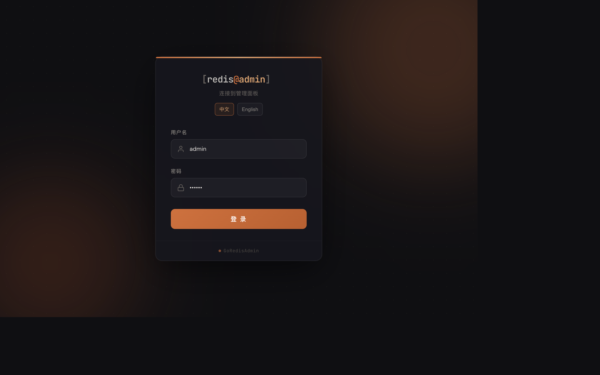
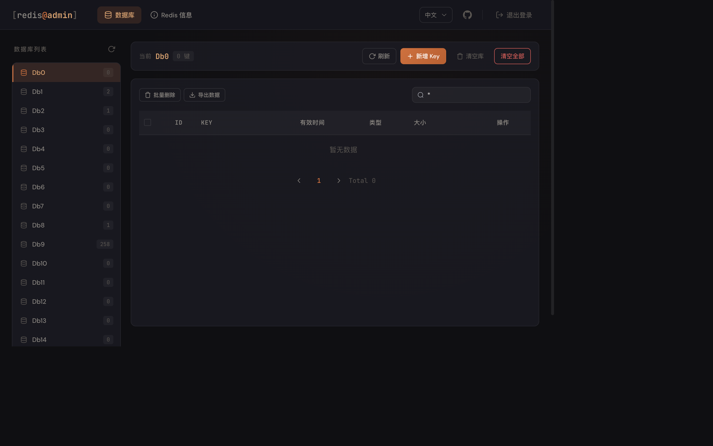
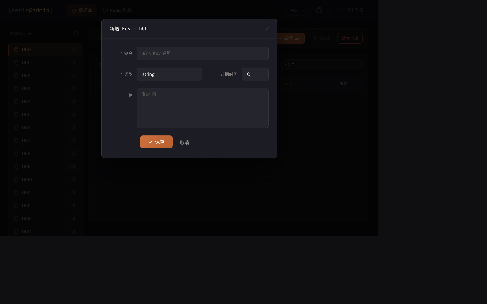
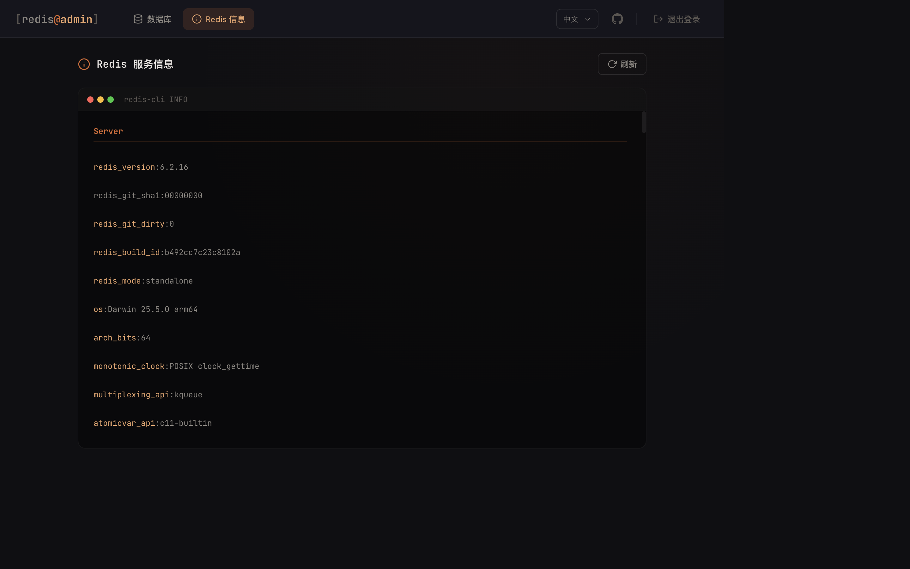

<p align="center">
    GoRedisAdmin
</p>

[English](README.md) | [中文](README.zh-CN.md)

## 简介

GoRedisAdmin 是一款使用 Golang (Gin) 和 Vue 2 (Element UI) 开发的 Redis 后台管理平台，提供在线数据库管理和简洁的操作界面，旨在方便用户管理 Redis 数据。

- [使用文档](https://github.com/linkaias/goRedisAdmin)

- 示例页面（本地截图预览）

### 登录页
默认登录信息：`admin` / `123456`

<p align="center">
    
</p>

### 首页
<p align="center">
    
</p>

### 新增 Key
<p align="center">
    
</p>

### Redis 信息页
<p align="center">
    
</p>

## 功能

- 管理面板支持中英双语，可一键切换语言并自动记住语言偏好
- 登录/注销（JWT Token 认证，自动续期）
- 数据库列表（Db0 - Db15）
- 数据库 Key 管理（支持模糊搜索）
- 新增 Key（支持 string、list、set、zset、hash 五种数据类型）
- Key 过期时间配置
- 删除指定 Key（支持批量删除）
- 清空数据库（flushdb）
- 清空全部库（flushall）
- 批量导出 Key 为 JSON 文件
- Redis INFO 信息查看
- 访问 IP 白名单

## 技术栈

| 层级 | 技术 |
| --- | --- |
| 后端 | Go 1.25 + Gin + go-redis v6 |
| 前端 | Vue 2 + Element UI + Axios |
| 认证 | JWT (golang-jwt) |
| 日志 | Logrus + 文件按天切割 |
| 配置 | INI 格式 (ini.v1) |

## 安装

### 环境要求

- Go 1.25+
- Node.js 14+（如需修改前端）
- Redis 实例

### 部署步骤

```bash
# 克隆项目
git clone https://github.com/linkaias/goRedisAdmin.git

# 进入项目目录
cd goRedisAdmin

# 创建日志和数据目录
mkdir -p var/export

# 修改配置文件（Redis连接、管理员账号、端口等）
vim config.ini

# 安装依赖
go mod tidy

# 启动服务
go run main.go
```

部署完成后本地浏览器访问 http://127.0.0.1:9527

### 配置说明

编辑 `config.ini`：

```ini
[redis]
name = Localhost          # 连接名称
host = 127.0.0.1          # Redis 地址
port = 6379               # Redis 端口
pwd =                     # Redis 密码（可选）
timeout = 60              # 连接超时（秒）
do_timeout = 60           # 操作超时（秒）

[whitelist_ip]
allow_ip = "127.0.0.1"   # IP 白名单，多个用逗号分割，为空则不限制

[admin]
username = "admin"        # 登录用户名
password = "123456"       # 登录密码
port = 9527               # 后台运行端口

[log]
log_path = "var/log.log"  # 日志路径
max_save_day = 30         # 日志保留天数
```

### 使用 Shell 脚本管理

```bash
cd shell

# 构建并启动
sh run.sh gradmin build

# 启动 / 停止 / 重启
sh run.sh gradmin start
sh run.sh gradmin stop
sh run.sh gradmin restart
```

### 前端开发

```bash
cd web
npm install
npm run serve    # 启动开发服务器
npm run build    # 构建到 html/ 目录
```

登录后可通过顶部导航中的语言切换按钮在中文和英文之间切换。

## 项目结构

```text
goRedisAdmin/
├── main.go                    # 程序入口
├── config.ini                 # 配置文件
├── routers/                   # 路由层
│   ├── view_router/           #   前端页面路由
│   ├── api_router/            #   API 路由（user/db/info）
│   └── middleware/            #   中间件（JWT认证、IP白名单）
├── controller/                # 控制器层
│   ├── base_controller.go     #   基础控制器
│   ├── user_controller/       #   登录/注销
│   ├── db_data_controller/    #   Redis 数据操作
│   └── info_controller/       #   Redis INFO
├── global/                    # 全局状态
│   ├── global_redis/          #   Redis 连接工厂
│   ├── global_response/       #   统一响应结构
│   ├── global_write_ip/       #   IP 白名单
│   └── initData/              #   配置加载
├── utils/                     # 工具类
│   ├── bcrypt_utils.go        #   JWT / bcrypt
│   ├── log_utils/             #   日志（logrus + 异步写入）
│   └── exoprt_utils/          #   Key 导出
├── html/                      # 前端构建产物（Go 静态托管）
├── web/                       # Vue 2 前端源码
└── var/                       # 运行时数据（日志、导出文件）
```

## API 接口

所有 API 前缀为 `/api/v1`，除登录外均需 `Authorization: Bearer <token>` 请求头。

| 方法 | 路径 | 说明 |
| --- | --- | --- |
| POST | /api/v1/user/login | 登录 |
| GET | /api/v1/user/logout | 注销 |
| GET | /api/v1/db/db_list | 获取数据库列表 |
| GET | /api/v1/db/get_keys | 获取指定库的 Key 列表 |
| GET | /api/v1/db/get_val | 获取 Key 详情 |
| POST | /api/v1/db/get_val_by_key | 按类型获取 Key 值 |
| POST | /api/v1/db/key | 新增 Key |
| DELETE | /api/v1/db/key | 删除 Key |
| POST | /api/v1/db/key/expire | 修改 Key 过期时间 |
| DELETE | /api/v1/db/flush | 清空数据库 |
| POST | /api/v1/db/export_keys | 批量导出 Key |
| GET | /api/v1/info/get_info | 获取 Redis INFO |

## JetBrains 开源支持

The GoRedisAdmin project has always been developed in the GoLand integrated development environment under JetBrains,
based on the free JetBrains Open Source license(s) genuine free license. I would like to express my gratitude.

<a href="https://www.jetbrains.com/">

</a>

## License

[MIT](https://github.com/linkaias/goRedisAdmin/blob/main/LICENSE)

Copyright (c) 2022-present LinKai
